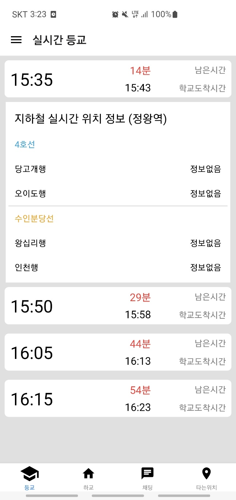
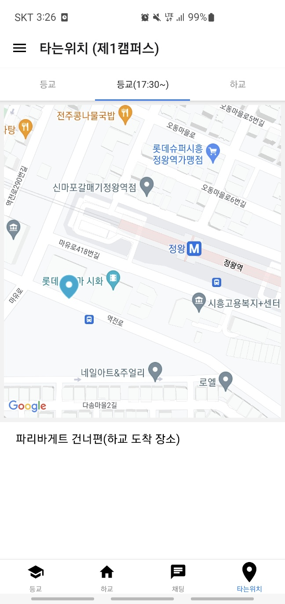
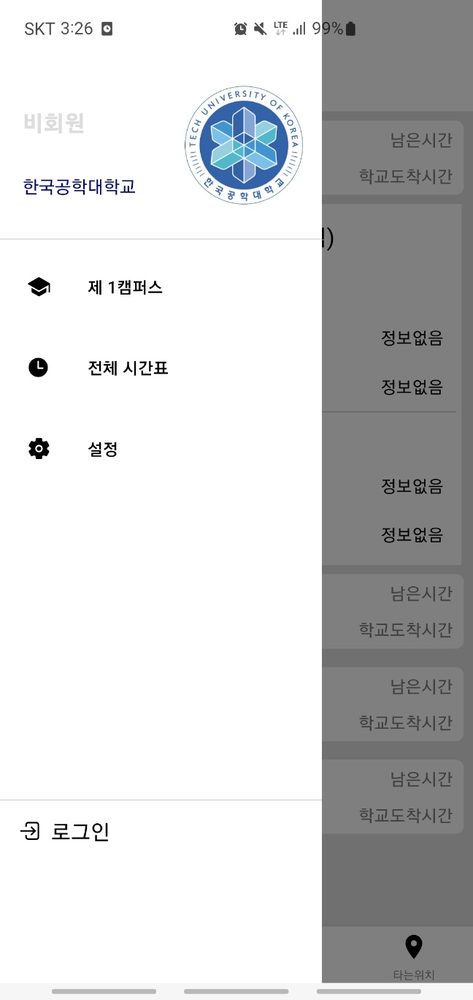
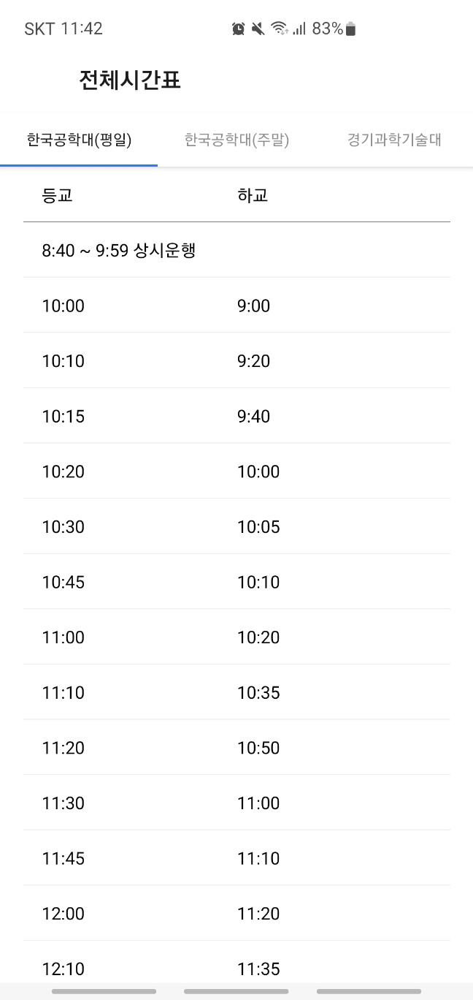
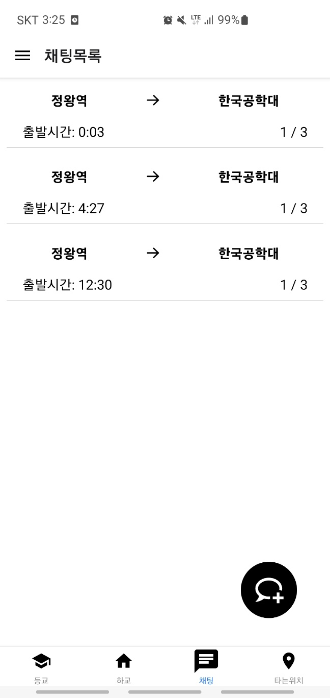
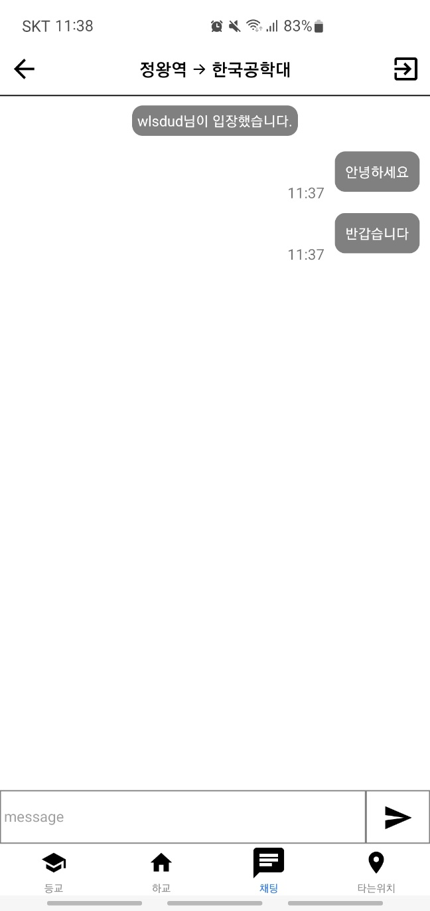

# TUK BUS Application

TUK & Gtec BUS Application with React-Native

- [Google Play Link](https://play.google.com/store/apps/details?id=com.tuk_bus&hl=en-KR)

## Application Info
React-Native 기반의 TUK & Gtec의 통학 버스 스케줄 애플리케이션

다음과 같은 기능을 포함하고 있다.
1. 서버에서 버스 시간표와 지하철 실시간 위치 정보를 받아와 표시
2. 구글 맵을 사용하여 탑승 위치에 대한 GPS 표시
3. 로그인 사용자가 이용할 수 있는 socket.io 기반의 채팅 기능

## Stacks
### Environment
- 
- 

### Development
- 
- 

### Library & Technology stacks
- [react navigation](https://reactnavigation.org)
- [Axios](https://github.com/axios/axios)
- [react-native-vector-icons](https://github.com/oblador/react-native-vector-icons)
- [webview](https://github.com/react-native-webview/react-native-webview)
- [moment.js](https://momentjs.com/)
- [socket.io-client](https://socket.io/)
- [react-native-async-storage](https://react-native-async-storage.github.io/async-storage/)

## Screens
### 실시간 등/하교

### 타는 위치

### Custom Drawer

### 전체 시간표

### 채팅

#### 채팅방 목록

#### 채팅방

